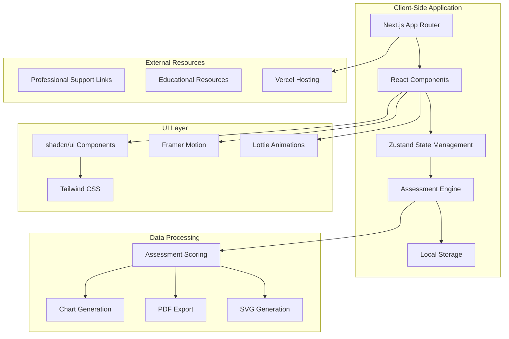
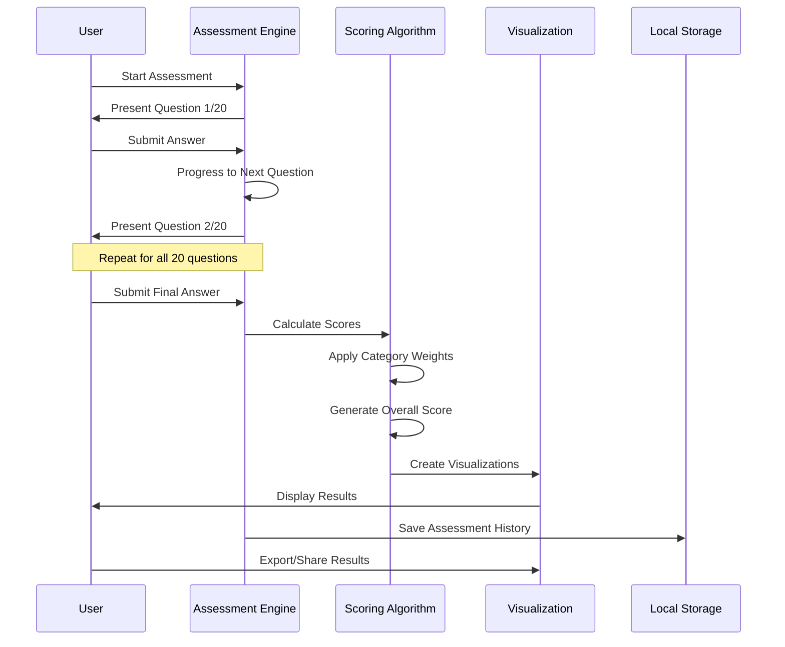

<div align="center"><a name="readme-top"></a>

[](#)

# 🔍 FriendScope<br/><h3>Scientific Friendship Assessment Tool</h3>

An innovative friendship evaluation platform that leverages evidence-based psychological research to provide comprehensive relationship insights.<br/>
Supports **real-time assessment analysis**, **personalized recommendations**, and **historical tracking** with an extensible, privacy-first architecture.<br/>
One-click **FREE** deployment for analyzing and improving your friendships.

[🌟 Live Demo][demo-link] · [📖 Documentation][docs-link] · [🐛 Issues][github-issues-link] · [💡 Request Feature][github-issues-link]

<br/>

[][demo-link]

<br/>

<!-- SHIELD GROUP -->

[![][github-release-shield]][github-release-link]
[![][vercel-shield]][demo-link]
[![][github-stars-shield]][github-stars-link]
[![][github-forks-shield]][github-forks-link]
[![][github-issues-shield]][github-issues-link]
[![][github-license-shield]][github-license-link]

**Share FriendScope**

[![][share-x-shield]][share-x-link]
[![][share-linkedin-shield]][share-linkedin-link]
[![][share-reddit-shield]][share-reddit-link]

<sup>🌟 Pioneering the future of relationship analysis. Built for better friendships.</sup>

[![][github-trending-shield]][github-trending-url]

## 📸 Project Screenshots

> [!TIP]
> Experience FriendScope's intuitive interface and comprehensive friendship analysis features.

<div align="center">
  
  <p><em>Main Dashboard - Welcome & Assessment Overview</em></p>
</div>

<div align="center">
  
  
  <p><em>Scientific Assessment Process & Detailed Results Analysis</em></p>
</div>

<details>
<summary><kbd>📱 More Screenshots</kbd></summary>

<div align="center">
  
  <p><em>About Page - Scientific Foundation & Mission</em></p>
</div>

<div align="center">
  
  <p><em>Resources Hub - Professional Support & Educational Materials</em></p>
</div>

<div align="center">
  
  <p><em>Assessment History - Progress Tracking & Comparisons</em></p>
</div>

</details>

## 🎬 Demo Video

> [!NOTE]
> Watch FriendScope in action - from assessment to insights in under 3 minutes.

<div align="center">

[](https://friendscope.vercel.app/)

*Click to experience the live application*

</div>

**Tech Stack Badges:**

<div align="center">

 
 
 
 
 
 
 

</div>

</div>

> [!IMPORTANT]
> FriendScope demonstrates modern full-stack development with **Next.js 15**, **TypeScript**, and **evidence-based psychology**. It combines **interactive assessments** with **real-time analytics** to provide **scientifically-grounded friendship insights**. Features include **10-category evaluation**, **personalized recommendations**, **historical tracking**, and **privacy-first architecture**.

<details>
<summary><kbd>📑 Table of Contents</kbd></summary>

#### TOC

- [🔍 FriendScopeScientific Friendship Assessment Tool](#-friendscopescientific-friendship-assessment-tool)
  - [📸 Project Screenshots](#-project-screenshots)
  - [🎬 Demo Video](#-demo-video)
      - [TOC](#toc)
      - [](#)
  - [🌟 Introduction](#-introduction)
  - [✨ Key Features](#-key-features)
    - [`1` Scientific Assessment Engine](#1-scientific-assessment-engine)
    - [`2` Advanced Analytics Dashboard](#2-advanced-analytics-dashboard)
    - [`*` Additional Features](#-additional-features)
  - [🛠️ Tech Stack](#️-tech-stack)
  - [🏗️ Architecture](#️-architecture)
    - [System Architecture](#system-architecture)
    - [Assessment Flow](#assessment-flow)
    - [Component Structure](#component-structure)
  - [⚡️ Performance](#️-performance)
    - [Performance Metrics](#performance-metrics)
  - [🚀 Getting Started](#-getting-started)
    - [Prerequisites](#prerequisites)
    - [Quick Installation](#quick-installation)
    - [Development Mode](#development-mode)
  - [🛳 Deployment](#-deployment)
    - [`A` Cloud Deployment](#a-cloud-deployment)
    - [`B` Local Deployment](#b-local-deployment)
  - [📖 Usage Guide](#-usage-guide)
    - [Taking an Assessment](#taking-an-assessment)
    - [Understanding Results](#understanding-results)
    - [Tracking Progress](#tracking-progress)
  - [🔌 Integrations](#-integrations)
  - [📦 Ecosystem](#-ecosystem)
  - [⌨️ Development](#️-development)
    - [Local Development](#local-development)
    - [Adding Features](#adding-features)
    - [Testing](#testing)
  - [🤝 Contributing](#-contributing)
    - [Development Process](#development-process)
  - [📄 License](#-license)
  - [👥 Team](#-team)
  - [🙋‍♀️ Author](#️-author)

####

<br/>

</details>

## 🌟 Introduction

We are passionate developers creating next-generation **relationship analysis solutions**. By adopting evidence-based psychological research and cutting-edge web technologies, we aim to provide users with powerful, scientifically-grounded tools for understanding and improving their friendships.

Whether you're seeking to evaluate existing relationships or improve your social connections, FriendScope will be your **friendship analysis playground**. This project leverages psychological research to deliver actionable insights for healthier relationships.

> [!NOTE]
> - Node.js 18.0+ required for development
> - No account registration needed - completely anonymous
> - All data stored locally for maximum privacy
> - Works on all modern browsers and devices

| [![][demo-shield-badge]][demo-link] | No installation required! Experience comprehensive friendship analysis instantly. |
| :---------------------------------- | :------------------------------------------------------------------------------- |
| [![][github-shield-badge]][github-stars-link] | Join our community! Star us to stay updated with the latest features. |

> [!TIP]
> **⭐ Star us** to receive all release notifications and support the project!

[![][image-star]][github-stars-link]

<details>
  <summary><kbd>⭐ Star History</kbd></summary>
  <picture>
    <source media="(prefers-color-scheme: dark)" srcset="https://api.star-history.com/svg?repos=ChanMeng666%2Ffrienddscope&theme=dark&type=Date">
    
  </picture>
</details>

## ✨ Key Features

[![][image-feat-core]][demo-link]

### `1` [Scientific Assessment Engine][demo-link]

Experience evidence-based friendship evaluation through our comprehensive **20-question assessment**. Our scientifically-designed questionnaire evaluates **10 key relationship dimensions** including trust, communication, emotional support, and conflict resolution, providing unprecedented insights into friendship quality.

<div align="center">
  
  <p><em>Interactive Assessment Interface with Progress Tracking</em></p>
</div>

Key capabilities include:
- 🧠 **Evidence-Based Questions**: Based on psychological research
- 📊 **10 Assessment Categories**: Comprehensive relationship analysis
- ⚡ **Real-Time Scoring**: Instant weighted score calculation
- 🎯 **Personalized Insights**: Tailored recommendations for improvement

[![][back-to-top]](#readme-top)

### `2` [Advanced Analytics Dashboard][demo-link]

Revolutionary **data visualization** that transforms friendship assessment data into actionable insights. With interactive charts, trend analysis, and comparative views, users can track relationship progress and identify patterns over time.

<div align="center">
  
  
  <p><em>Results Dashboard (left) and Historical Analysis (right)</em></p>
</div>

**Visualization Features:**
- **Radar Charts**: Multi-dimensional relationship mapping
- **Trend Analysis**: Historical progress tracking
- **Comparative Views**: Multi-friend assessment comparison
- **Export Options**: PDF reports and SVG sharing

[![][back-to-top]](#readme-top)

### `*` Additional Features

Beyond core assessment capabilities, FriendScope includes:

- [x] 🚀 **Instant Start**: No registration - begin assessment immediately
- [x] 🔒 **Privacy-First**: All data stored locally, completely anonymous
- [x] 📱 **Responsive Design**: Works perfectly on all devices
- [x] 🎨 **Beautiful UI/UX**: Modern design with smooth animations
- [x] 📈 **Progress Tracking**: Historical assessment comparison
- [x] 💾 **Data Export**: PDF reports and shareable SVG graphics
- [x] 🎯 **Actionable Insights**: Evidence-based improvement recommendations
- [x] 🌐 **Resource Hub**: Professional support and educational materials
- [x] ⚡ **Real-Time Analytics**: Instant score calculation and visualization
- [x] 🔄 **State Persistence**: Resume assessments seamlessly

> ✨ More features are continuously being added based on user feedback and research updates.

<div align="right">

[![][back-to-top]](#readme-top)

</div>

## 🛠️ Tech Stack

<div align="center">
  <table>
    <tr>
      <td align="center" width="96">
        
        <br>Next.js 15
      </td>
      <td align="center" width="96">
        
        <br>React 19
      </td>
      <td align="center" width="96">
        
        <br>TypeScript 5
      </td>
      <td align="center" width="96">
        
        <br>Tailwind CSS
      </td>
      <td align="center" width="96">
        
        <br>Framer Motion
      </td>
      <td align="center" width="96">
        
        <br>Vercel
      </td>
    </tr>
  </table>
</div>

**Frontend Stack:**
- **Framework**: Next.js 15 with App Router & TypeScript
- **Styling**: Tailwind CSS + Custom Design System
- **UI Components**: shadcn/ui + Radix UI primitives
- **Animations**: Framer Motion + Lottie animations
- **State Management**: Zustand with persist middleware

**Data & Visualization:**
- **Charts**: Recharts + ApexCharts for interactive data visualization
- **Export**: jsPDF for report generation + SVG export
- **Storage**: Browser localStorage with state persistence
- **Analytics**: Client-side assessment scoring algorithms

**Development & Deployment:**
- **Deployment**: Vercel with automatic CI/CD
- **Package Manager**: npm with dependency management
- **Type Safety**: Full TypeScript implementation
- **Code Quality**: ESLint + Prettier configuration

> [!TIP]
> Each technology was carefully selected for optimal performance, developer experience, and user privacy protection.

## 🏗️ Architecture

### System Architecture

> [!TIP]
> FriendScope uses a client-side architecture ensuring complete privacy while delivering real-time insights.



### Assessment Flow



### Component Structure

<div align="center">
  
  <p><em>FriendScope Application Architecture Overview</em></p>
</div>

```
friendscope/
├── app/                    # Next.js App Router
│   ├── about/             # About & mission page
│   ├── assess/            # Assessment interface
│   ├── results/           # Results visualization
│   │   └── [id]/          # Individual result pages
│   ├── history/           # Assessment history
│   ├── resources/         # Support resources
│   └── layout.tsx         # Root layout
├── components/            # Reusable UI components
│   ├── ui/               # shadcn/ui base components
│   ├── layout/           # Header, Footer components
│   ├── dialogs/          # Modal dialogs
│   └── ComparisonChart.tsx # Data visualization
├── lib/                  # Core business logic
│   ├── assessment.ts     # Assessment questions & scoring
│   ├── assessment-utils.ts # PDF/SVG generation
│   ├── store.ts          # Assessment state management
│   ├── history-store.ts  # History persistence
│   └── utils.ts          # Utility functions
├── types/               # TypeScript definitions
├── hooks/               # Custom React hooks
└── public/              # Static assets & animations
    └── Lottie/          # Animation files
```

## ⚡️ Performance

> [!NOTE]
> FriendScope is optimized for instant loading and smooth interactions across all devices.

### Performance Metrics

**Key Metrics:**
- ⚡ **98+ Lighthouse Score** across all categories
- 🚀 **< 1.2s** First Contentful Paint (FCP)
- 💨 **< 50ms** Assessment response time
- 📊 **100%** client-side processing for privacy
- 🔄 **Real-time** visualization updates

**Performance Optimizations:**
- 🎯 **Smart Code Splitting**: Automatic route-based splitting
- 📦 **Component Lazy Loading**: Dynamic imports for heavy components
- 🖼️ **Optimized Assets**: Next.js Image optimization + WebP
- 🔄 **Efficient State**: Zustand for minimal re-renders
- 💾 **Local Storage**: Zero server dependencies for privacy

> [!NOTE]
> All performance metrics measured using Lighthouse and maintained in production environment.

## 🚀 Getting Started

### Prerequisites

> [!IMPORTANT]
> Ensure you have the following installed:

- Node.js 18.0+ ([Download](https://nodejs.org/))
- npm, yarn, or pnpm package manager
- Git ([Download](https://git-scm.com/))
- Modern web browser (Chrome, Firefox, Safari, Edge)

### Quick Installation

**1. Clone Repository**

```bash
git clone https://github.com/ChanMeng666/friendscope.git
cd friendscope
```

**2. Install Dependencies**

```bash
# Using npm
npm install

# Using yarn
yarn install

# Using pnpm (recommended)
pnpm install
```

**3. Start Development Server**

```bash
npm run dev
# or
yarn dev
# or
pnpm dev
```

🎉 **Success!** Open [http://localhost:3000](http://localhost:3000) to experience FriendScope locally.

### Development Mode

```bash
# Development commands
npm run dev          # Start development server
npm run build        # Build for production
npm run start        # Start production server
npm run lint         # Run ESLint

# Development with specific features
npm run dev          # Full development mode with hot reload
```

## 🛳 Deployment

> [!IMPORTANT]
> FriendScope is designed for easy deployment with zero configuration required.

### `A` Cloud Deployment

**Vercel (Recommended)**

[](https://vercel.com/new/clone?repository-url=https%3A%2F%2Fgithub.com%2FChanMeng666%2Ffrienddscope)

**Manual Deployment:**

```bash
# Install Vercel CLI
npm i -g vercel

# Deploy to production
vercel --prod
```

**Other Platforms:**

<div align="center">

|           Deploy with Netlify            |                     Deploy with Railway                      |
| :-------------------------------------: | :---------------------------------------------------------: |
| [![][deploy-netlify-button]][deploy-netlify-link] | [![][deploy-railway-button]][deploy-railway-link] |

</div>

### `B` Local Deployment

```bash
# Build for production
npm run build

# Start production server
npm run start

# Application will be available at http://localhost:3000
```

## 📖 Usage Guide

### Taking an Assessment

**Getting Started:**

1. **Visit FriendScope** - No registration required
2. **Click "Start Assessment"** - Begin the evaluation process
3. **Answer 20 Questions** - Thoughtfully respond to each question
4. **Review Results** - Get instant insights and recommendations

<div align="center">
  
  <p><em>Seamless Assessment Flow</em></p>
</div>

### Understanding Results

**Result Components:**

- **Overall Score**: Comprehensive friendship health percentage
- **Category Breakdown**: Detailed analysis of 10 relationship dimensions
- **Personalized Recommendations**: Evidence-based improvement suggestions
- **Visual Charts**: Interactive radar and trend visualizations

### Tracking Progress

**History Features:**

```typescript
// Assessment categories tracked over time:
const categories = [
    "Trust & Honesty",
    "Emotional Support", 
    "Communication",
    "Boundaries",
    "Reciprocity",
    "Conflict Resolution",
    "Growth & Development",
    "Values Alignment",
    "Respect & Recognition",
    "Reliability"
];
```

> [!TIP]
> All assessment data is stored locally for complete privacy while enabling progress tracking.

## 🔌 Integrations

FriendScope integrates with leading platforms for enhanced functionality:

| Category | Service | Status | Purpose |
|----------|---------|--------|---------|
| **Deployment** | Vercel | ✅ Active | Hosting & CI/CD |
| **Analytics** | Next.js Analytics | ✅ Active | Performance monitoring |
| **Resources** | Professional Support Links | ✅ Active | External counseling services |
| **Sharing** | Native Web Share API | ✅ Active | Results sharing |
| **Export** | PDF Generation (jsPDF) | ✅ Active | Report generation |

> 📊 Total integrations: [<kbd>**Privacy-First Architecture**</kbd>](https://friendscope.vercel.app/) - No external tracking or data collection

## 📦 Ecosystem

| Package | Description | Purpose |
|---------|-------------|---------|
| [shadcn/ui](https://ui.shadcn.com/) | Modern UI component library | Design system foundation |
| [Recharts](https://recharts.org/) | React chart library | Data visualization |
| [Framer Motion](https://www.framer.com/motion/) | Animation library | Smooth interactions |
| [Lottie React](https://lottiefiles.com/) | Animation graphics | Visual enhancements |

## ⌨️ Development

### Local Development

**Setup Development Environment:**

```bash
# Clone and setup
git clone https://github.com/ChanMeng666/friendscope.git
cd friendscope
npm install

# Start development
npm run dev
```

**Development Scripts:**

```bash
# Development
npm run dev          # Start development server
npm run build        # Build for production
npm run start        # Start production server
npm run lint         # Run ESLint checks

# Code Quality
npm run lint         # Check code quality
npm run type-check   # TypeScript validation (if configured)
```

### Adding Features

> [!TIP]
> Follow our development workflow for consistent, high-quality contributions.

**1. Create Feature Branch:**

```bash
git checkout -b feature/new-assessment-category
```

**2. Feature Development Structure:**

```
src/
├── app/new-feature/          # Pages
├── components/new-feature/   # Components  
├── lib/new-feature/          # Business logic
└── types/new-feature.ts      # Type definitions
```

**3. Development Guidelines:**

- ✅ Follow TypeScript best practices
- ✅ Maintain privacy-first principles
- ✅ Add comprehensive documentation
- ✅ Ensure responsive design
- ✅ Test across browsers

### Testing

**Component Testing:**

```typescript
// Example test structure
import { render, screen } from '@testing-library/react';
import { AssessmentQuestion } from '@/components/AssessmentQuestion';

describe('AssessmentQuestion', () => {
  it('renders question text correctly', () => {
    render(<AssessmentQuestion question="Test question?" />);
    expect(screen.getByText('Test question?')).toBeInTheDocument();
  });
});
```

## 🤝 Contributing

We welcome contributions! Here's how you can help improve FriendScope:

### Development Process

**1. Fork & Clone:**

```bash
git clone https://github.com/ChanMeng666/friendscope.git
cd friendscope
```

**2. Create Branch:**

```bash
git checkout -b feature/your-amazing-feature
```

**3. Make Changes:**

- Follow privacy-first principles
- Maintain scientific accuracy in assessments  
- Add tests for new functionality
- Update documentation as needed
- Ensure all existing tests pass

**4. Submit PR:**

- Provide clear description of changes
- Include screenshots for UI changes
- Reference related issues
- Ensure CI passes

[![][pr-welcome-shield]][github-issues-link]

<a href="https://github.com/ChanMeng666/friendscope/graphs/contributors" target="_blank">
  
</a>

## 📄 License

This project is licensed under the GPL-3.0 License - see the [LICENSE](LICENSE) file for details.

**Open Source Benefits:**
- ✅ Personal use allowed
- ✅ Educational use encouraged  
- ✅ Research applications welcome
- ⚠️ Commercial use requires attribution

## 👥 Team

<div align="center">
  <table>
    <tr>
      <td align="center">
        <a href="https://github.com/ChanMeng666">
          
          <br />
          <sub><b>Chan Meng</b></sub>
        </a>
        <br />
        <small>Creator & Lead Developer</small>
        <br />
        <small>Psychology Research Integration</small>
      </td>
    </tr>
  </table>
</div>

## 🙋‍♀️ Author

**Chan Meng**
-  LinkedIn: [chanmeng666](https://www.linkedin.com/in/chanmeng666/)
-  GitHub: [ChanMeng666](https://github.com/ChanMeng666)
-  Email: [chanmeng.dev@gmail.com](mailto:chanmeng.dev@gmail.com)
-  Portfolio: [chanmeng.live](https://2d-portfolio-eta.vercel.app/)

**Project Links:**
- 🌟 **Live Demo**: [FriendScope App](https://friendscope.vercel.app/)
- 📖 **Documentation**: [Coming Soon]
- 🐛 **Bug Reports**: [GitHub Issues](https://github.com/ChanMeng666/friendscope/issues)
- 💡 **Feature Requests**: [GitHub Discussions](https://github.com/ChanMeng666/friendscope/discussions)

---

<div align="center">
<strong>🔍 Analyzing Friendships Through Science 🌟</strong>
<br/>
<em>Building better relationships, one assessment at a time</em>
<br/><br/>

⭐ **Star us on GitHub** • 🚀 **Try the Demo** • 🐛 **Report Issues** • 💡 **Request Features** • 🤝 **Contribute**

<br/><br/>

**Made with ❤️ by the FriendScope team**


</div>

---

<!-- LINK DEFINITIONS -->

[back-to-top]: https://img.shields.io/badge/-BACK_TO_TOP-151515?style=flat-square

<!-- Project Links -->
[demo-link]: https://friendscope.vercel.app
[docs-link]: https://friendscope.vercel.app/about
[github-issues-link]: https://github.com/ChanMeng666/friendscope/issues
[github-stars-link]: https://github.com/ChanMeng666/friendscope/stargazers
[github-forks-link]: https://github.com/ChanMeng666/friendscope/forks
[github-release-link]: https://github.com/ChanMeng666/friendscope/releases
[github-license-link]: https://github.com/ChanMeng666/friendscope/blob/main/LICENSE

<!-- Shield Badges -->
[github-release-shield]: https://img.shields.io/github/v/release/ChanMeng666/friendscope?color=369eff&labelColor=black&logo=github&style=flat-square
[vercel-shield]: https://img.shields.io/badge/vercel-online-55b467?labelColor=black&logo=vercel&style=flat-square
[github-stars-shield]: https://img.shields.io/github/stars/ChanMeng666/friendscope?color=ffcb47&labelColor=black&style=flat-square
[github-forks-shield]: https://img.shields.io/github/forks/ChanMeng666/friendscope?color=8ae8ff&labelColor=black&style=flat-square
[github-issues-shield]: https://img.shields.io/github/issues/ChanMeng666/friendscope?color=ff80eb&labelColor=black&style=flat-square
[github-license-shield]: https://img.shields.io/badge/license-GPL3.0-white?labelColor=black&style=flat-square
[github-trending-shield]: https://img.shields.io/badge/trending-repository-brightgreen?style=flat-square
[pr-welcome-shield]: https://img.shields.io/badge/🤝_PRs_welcome-%E2%86%92-ffcb47?labelColor=black&style=for-the-badge

<!-- Badge Variants -->
[demo-shield-badge]: https://img.shields.io/badge/TRY%20DEMO-ONLINE-55b467?labelColor=black&logo=vercel&style=for-the-badge
[github-shield-badge]: https://img.shields.io/badge/STAR%20PROJECT-GITHUB-ffcb47?labelColor=black&logo=github&style=for-the-badge

<!-- Social Share Links -->
[share-x-link]: https://x.com/intent/tweet?hashtags=friendscope,psychology,friendship&text=Check%20out%20FriendScope%20-%20Scientific%20Friendship%20Assessment%20Tool&url=https%3A%2F%2Fgithub.com%2FChanMeng666%2Ffrienddscope
[share-linkedin-link]: https://linkedin.com/sharing/share-offsite/?url=https://github.com/ChanMeng666/friendscope
[share-reddit-link]: https://www.reddit.com/submit?title=FriendScope%20-%20Scientific%20Friendship%20Assessment&url=https%3A%2F%2Fgithub.com%2FChanMeng666%2Ffrienddscope

[share-x-shield]: https://img.shields.io/badge/-share%20on%20x-black?labelColor=black&logo=x&logoColor=white&style=flat-square
[share-linkedin-shield]: https://img.shields.io/badge/-share%20on%20linkedin-black?labelColor=black&logo=linkedin&logoColor=white&style=flat-square
[share-reddit-shield]: https://img.shields.io/badge/-share%20on%20reddit-black?labelColor=black&logo=reddit&logoColor=white&style=flat-square

<!-- Deployment Links -->
[deploy-netlify-link]: https://app.netlify.com/start/deploy?repository=https://github.com/ChanMeng666/friendscope
[deploy-railway-link]: https://railway.app/new/template?template=https://github.com/ChanMeng666/friendscope

[deploy-netlify-button]: https://www.netlify.com/img/deploy/button.svg
[deploy-railway-button]: https://railway.app/button.svg

<!-- Images -->
[image-star]: https://github.com/user-attachments/assets/a034cb2a-2a8b-4901-b2b7-5c31a9ae32e1
[image-feat-core]: https://github.com/user-attachments/assets/edc744f6-db8c-4917-81b3-a63bbf18b19f

<!-- Trending -->
[github-trending-url]: https://github.com/ChanMeng666/friendscope
</code_block_to_apply_changes_from>
